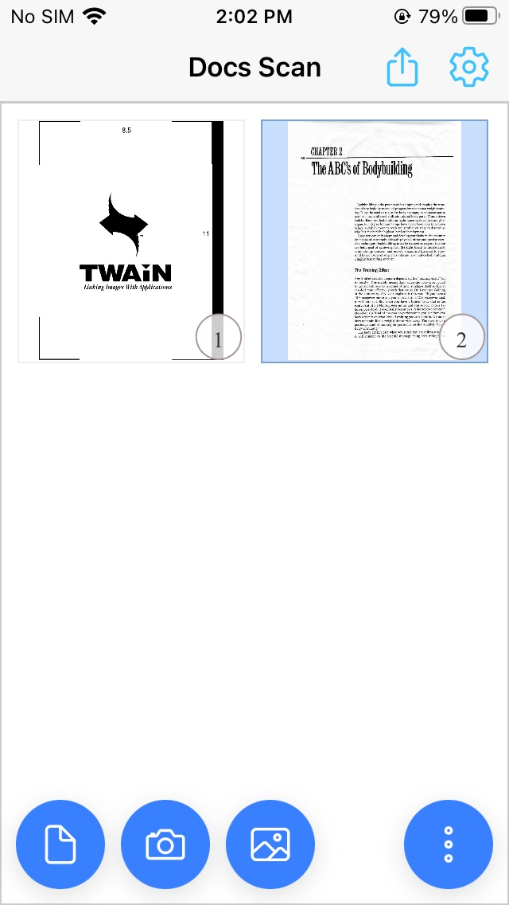

# Ionic-React-Document-Scanner

Ionic React Document Scanner using Dynamic Web TWAIN

[Online demo](https://courageous-cactus-2758a1.netlify.app/)

Screenshot:




How to run it locally:

1. Install Ionic according to its [docs](https://ionicframework.com/docs/intro/cli).
2. Clone the project: 

   ```
   git clone https://github.com/xulihang/Ionic-React-Document-Scanner
   ```
   
3. cd Ionic-React-Document-Scanner & npm install
4. Run the app:

   ```
   npm run start
   ```
   
5. Run for Android or iOS:

   ```
   npm run build
   npx cap sync
   ```
   
   Then use Android Studio or Xcode to open the project.
   
   
   
Demo video:
   
[demo video](https://user-images.githubusercontent.com/5462205/233238689-b60a6339-bffe-4fac-8624-edab8860c625.mp4)
